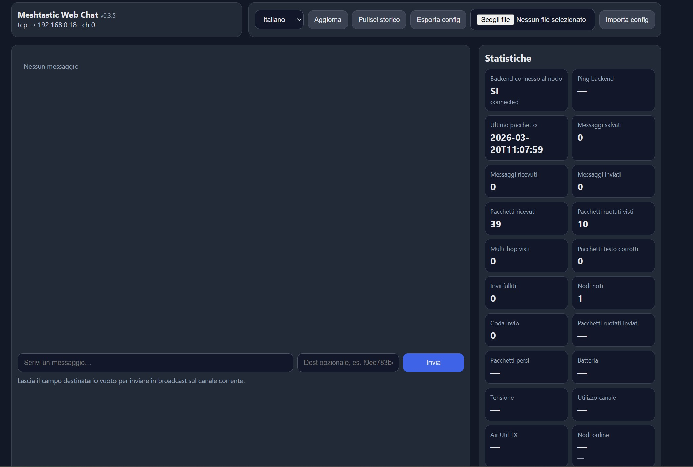

# Meshtastic Web Chat

**Version:** v0.4.3  
**Internal folder path:** `meshtastic_webchat`  
**Service name:** `meshtastic-webchat.service`

A lightweight browser interface for Meshtastic nodes.

This release is intentionally rebuilt from a verified working base to keep the code, service file, and documentation aligned.

## Screenshot



## What this release actually includes

- Single service deployment with `systemd`
- Single application path: `meshtastic_webchat`
- Node connection via **serial** or **TCP**
- Configuration loaded from `app_config.json`
- Optional HTTPS with Flask `ssl_context="adhoc"`
- Simple web UI for messages, nodes, send, clear history
- SQLite local history storage

## What this release does **not** include

This `v0.4.3` package is a coherent, working baseline. It does **not** claim advanced features that were not fully verified end-to-end, such as:

- multi-client proxy mode
- advanced stats sidebar
- debug API
- configuration import/export from the UI
- full i18n selector

Those can be re-added later on top of a stable base.

## Installation

Create and activate a virtual environment:

```bash
cd /home/meshtastic/meshtastic_webchat
python3 -m venv .venv
source .venv/bin/activate
python -m pip install --upgrade pip
python -m pip install flask meshtastic pypubsub pyopenssl
```

## Configuration

Edit `app_config.json`.

### Serial example

```json
{
  "version": "0.4.3",
  "node": {
    "mode": "serial",
    "host": "",
    "port": "/dev/ttyUSB0",
    "channel": 0
  },
  "web": {
    "listen_host": "0.0.0.0",
    "listen_port": 8088,
    "ssl_adhoc": true
  }
}
```

### TCP example

```json
{
  "version": "0.4.3",
  "node": {
    "mode": "tcp",
    "host": "192.168.0.18",
    "port": "",
    "channel": 0
  },
  "web": {
    "listen_host": "0.0.0.0",
    "listen_port": 8088,
    "ssl_adhoc": true
  }
}
```

## Run manually

```bash
source .venv/bin/activate
python app.py --config /home/meshtastic/meshtastic_webchat/app_config.json
```

## Run with systemd

Copy `meshtastic-webchat.service` to `/etc/systemd/system/` and then:

```bash
sudo systemctl daemon-reload
sudo systemctl enable meshtastic-webchat
sudo systemctl start meshtastic-webchat
sudo systemctl status meshtastic-webchat
journalctl -u meshtastic-webchat -f
```

## Web UI

Open:

- `https://IP_OR_HOST:8088` if `ssl_adhoc` is `true`
- `http://IP_OR_HOST:8088` if `ssl_adhoc` is `false`

With `ssl_adhoc`, the browser will show a self-signed certificate warning. That is expected.

## Troubleshooting

### `one of the arguments --port --host is required`

This means you are running an older build that does not support `--config`, or your service file and `app.py` are mismatched.

This `v0.4.3` package fixes that by keeping `app.py`, `app_config.json`, and `meshtastic-webchat.service` aligned.

### `ssl_adhoc requires pyopenssl`

Install it in the same virtual environment:

```bash
source .venv/bin/activate
python -m pip install pyopenssl
```

### Serial permissions

For serial mode, make sure the `meshtastic` user is in `dialout`:

```bash
sudo usermod -a -G dialout meshtastic
```

## Italian notes / Note italiane

Questa release `v0.4.3` è stata ricostruita da una base semplice ma verificata davvero, per evitare altre regressioni tra:

- `app.py`
- `app_config.json`
- `meshtastic-webchat.service`
- `README.md`

Se vuoi funzioni più avanzate, conviene aggiungerle di nuovo partendo da questa base coerente.
