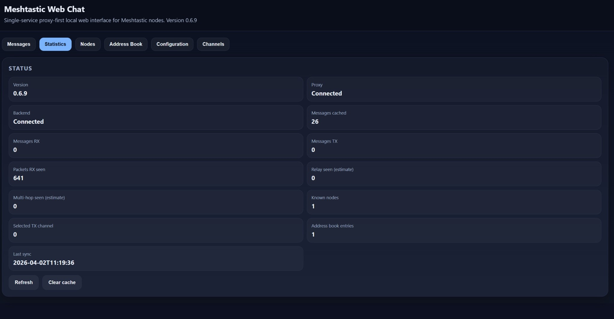

# Meshtastic Web Chat

**Version:** v0.6.9  
**Service:** `meshtastic-webchat.service`

Meshtastic Web Chat is a browser-based interface for Meshtastic nodes built around a **single active backend connection**. The web UI talks to `app.py`, which talks to the local proxy in `proxy/main.py`. The proxy owns the real serial or TCP connection to the radio.



## Highlights

- Serial and TCP node support
- Tabbed UI for messages, statistics, nodes, address book, configuration, and channels
- Channel management through the active backend connection
- TCP-safe **URL-only mode** when a node does not expose a structured channel list
- GitHub-ready repository layout with changelog and screenshot

## Architecture

```text
Browser -> app.py -> proxy/main.py -> Meshtastic node
```

The backend proxy keeps a **single upstream connection** to the node. This prevents multi-client conflicts on serial devices and keeps TCP connections consistent.

## Project layout

```text
.
├── app.py
├── app_config.json
├── address_book.json
├── meshtastic-webchat.service
├── proxy/
│   └── main.py
├── templates/
│   └── index.html
├── docs/
│   └── screenshot-ui-v0.7.2.jpg
├── README.md
├── CHANGELOG.md
└── .gitignore
```

## Requirements

- Linux with `systemd`
- Python 3.10+ recommended
- A Meshtastic node reachable over serial or TCP
- `meshtastic` Python package installed in the virtual environment

Example check:

```bash
source .venv/bin/activate
python -m pip show meshtastic
```

## Installation

```bash
cd /home/meshtastic/meshtastic_webchat
python3 -m venv .venv
source .venv/bin/activate
python -m pip install --upgrade pip
python -m pip install -r requirements.txt
chmod +x start_webchat.sh
```

Install the service:

```bash
sudo cp meshtastic-webchat.service /etc/systemd/system/meshtastic-webchat.service
sudo systemctl daemon-reload
sudo systemctl enable meshtastic-webchat
sudo systemctl start meshtastic-webchat
```

## Configuration

Edit `app_config.json`.

### Serial example

```json
{
  "node": {
    "mode": "serial",
    "port": "/dev/ttyUSB0",
    "channel": 0
  },
  "proxy": {
    "host": "127.0.0.1",
    "port": 4404
  }
}
```

### TCP example

```json
{
  "node": {
    "mode": "tcp",
    "host": "192.168.1.50",
    "tcp_port": 4403,
    "channel": 0
  },
  "proxy": {
    "host": "127.0.0.1",
    "port": 4404
  }
}
```

## Using the UI

### Messages
- Read cached messages
- Send broadcast and direct messages

### Statistics
- See connection state and counters

### Nodes
- Inspect discovered nodes
- Select recipients

### Address Book
- Map `node_id` values to readable aliases

### Configuration
- Import and export app configuration

### Channels
There are two channel modes:

1. **Full channel mode**
   - The node exposes a structured channel list
   - You can list channels, choose the TX channel, join from URL, and delete secondary channels

2. **URL-only mode**
   - The node/API combination does not expose `localNode.channels`
   - You can still use **Join from URL** and verify the current channel URL
   - This is especially useful for some TCP-connected nodes

## Troubleshooting

### Serial node works, TCP node shows no channel list
If the TCP node shows **URL-only mode**, the connection is still valid. It means the node does not currently expose a structured channel list through the installed Meshtastic Python API, even though URL-based channel operations still work.

### `Could not exclusive lock port /dev/ttyUSB0`
This should not happen on a TCP node. Channel actions must reuse the active backend connection instead of opening a new serial session. v0.6.9 keeps channel operations bound to the live proxy connection.

### Service does not start
```bash
sudo systemctl status meshtastic-webchat
journalctl -u meshtastic-webchat -n 100 --no-pager
```

### Check installed Meshtastic package
```bash
source .venv/bin/activate
python -m pip show meshtastic
python -m pip freeze | grep -i meshtastic
```


## License

See `LICENSE`.
