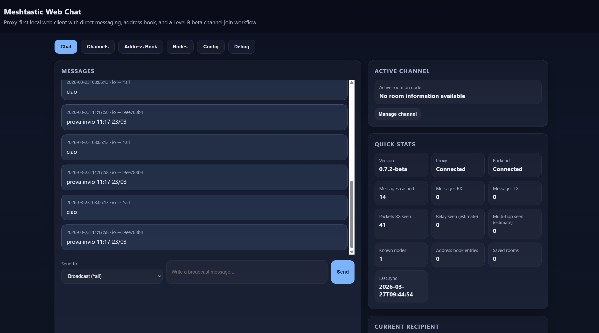

# Meshtastic Web Chat

**Version:** v0.7.2-beta  
**Status:** Level B beta  
**Internal folder path:** `meshtastic_webchat`

## Project purpose

Meshtastic Web Chat is a lightweight browser-based interface for Meshtastic nodes, designed to make day-to-day messaging and node management easier from a desktop browser.

This project uses a **proxy-first architecture**:

- the browser talks to the local Flask web application;
- the web application talks to the embedded local proxy;
- the proxy keeps the single live connection to the real Meshtastic node.

This design helps reduce the instability that can happen when multiple clients connect directly to the same Meshtastic TCP endpoint.

## What this beta adds

This **Level B beta** introduces the first room/channel management workflow that can actually help a node **join a new channel** from a Meshtastic channel URL or hash.

The goal of this beta is to provide a visible and testable workflow for:

1. pasting a channel URL or hash,
2. importing it as a room,
3. previewing the room locally,
4. backing up the current node channel,
5. applying the new room to the node,
6. rolling back the last backup.

## Main features

- browser-based chat UI
- broadcast and direct messages
- address book (`node_id -> alias`)
- embedded local proxy
- room import/apply/rollback beta workflow
- English UI
- `systemd` service included
- local JSON config and storage files

## Interface layout

The interface is organized into visible tabs:

- **Chat**
  - active room summary
  - quick status cards
  - messages
  - composer for broadcast and direct messages
- **Channels**
  - paste channel URL / hash
  - import room
  - apply room to node
  - rollback last backup
  - saved rooms
  - backups
- **Address Book**
  - local alias mapping
- **Nodes**
  - cached nodes and quick actions
- **Config**
  - export/import local app config
- **Debug**
  - raw diagnostic state

## Screenshot



## Installation

### 1. Extract the package

Extract the ZIP so that the project ends up in:

```text
/home/meshtastic/meshtastic_webchat
```

### 2. Create or reuse the virtual environment

```bash
cd /home/meshtastic/meshtastic_webchat
python3 -m venv .venv
source .venv/bin/activate
python -m pip install --upgrade pip
python -m pip install -r requirements.txt
```

### 3. Configure the application

Edit:

```text
/home/meshtastic/meshtastic_webchat/app_config.json
```

#### Serial example

```json
{
  "version": "0.7.2-beta",
  "node": {
    "mode": "serial",
    "host": "",
    "port": "/dev/ttyUSB0",
    "channel": 0
  },
  "web": {
    "listen_host": "0.0.0.0",
    "listen_port": 8088,
    "ssl_adhoc": true
  },
  "ui": {
    "default_language": "en"
  }
}
```

#### TCP example

```json
{
  "version": "0.7.2-beta",
  "node": {
    "mode": "tcp",
    "host": "192.168.0.18",
    "port": "",
    "channel": 0
  },
  "web": {
    "listen_host": "0.0.0.0",
    "listen_port": 8088,
    "ssl_adhoc": true
  },
  "ui": {
    "default_language": "en"
  }
}
```

### 4. Install the systemd service

Copy the provided service file:

```bash
sudo cp meshtastic-webchat.service /etc/systemd/system/meshtastic-webchat.service
sudo systemctl daemon-reload
sudo systemctl enable meshtastic-webchat
sudo systemctl start meshtastic-webchat
```

### 5. Follow the logs

```bash
journalctl -u meshtastic-webchat -f
```

## How it works

### Chat

Use the **Chat** tab for daily operation:

- read messages
- send broadcast messages
- pick a specific node for direct messaging

### Channels (Level B beta)

Use the **Channels** tab to test room/channel joining.

#### Join a new channel from URL/hash

1. Paste a Meshtastic channel URL or `#...` hash into **Paste channel URL / hash**.
2. Optionally enter a local room name.
3. Click **Import room**.
4. The room is stored locally.
5. Click **Apply** on the saved room entry.
6. The current primary channel is backed up before apply.
7. The node is switched to the imported room using the Meshtastic CLI.

#### Rollback

Use **Rollback last backup** to restore the previous room/channel state.

## Important beta notes

This is a **beta** implementation of channel join workflow.

Current assumptions and limitations:

- only the **last backup** is restored by the rollback button;
- the workflow is designed for **explicit apply**, not automatic channel switching;
- this modifies the **real node channel configuration**;
- you should treat this feature as experimental until fully validated on your setup.

## Files used by the application

- `app_config.json` – runtime configuration
- `address_book.json` – local alias mapping
- `rooms.json` – saved imported rooms
- `room_backups.json` – backup history for channel rollback
- `webchat_cache.db` – cached message and state storage

## systemd behavior

This project is shipped as a **single service**:

- `meshtastic-webchat.service`

The service runs `start_webchat.sh`, which:

1. reads `app_config.json`,
2. starts the embedded proxy,
3. waits for the local proxy socket,
4. starts the Flask web application.

## Troubleshooting

### The web app starts but cannot reach the node

Check:

```bash
journalctl -u meshtastic-webchat -f
```

Then verify the node target in `app_config.json`.

### Serial mode does not work

Make sure the service user can access the serial device:

```bash
sudo usermod -a -G dialout meshtastic
```

Then log out or reboot.

### TCP mode times out

Make sure the node is reachable and that no competing direct TCP client is constantly interfering with the same node.

### The UI looks old or unchanged

Do a hard refresh in the browser and make sure the installed `templates/index.html` matches this release.

## Changelog

### v0.7.2-beta

- rebuilt the UI as **real visible tabs**
- moved room/channel join workflow into a dedicated **Channels** tab
- kept direct messaging and address book behavior
- kept Level B beta room import/apply/rollback flow
- updated README to describe the beta clearly

### v0.7.0-beta

- first beta of Level B room management
- room import, apply, rollback introduced

### Stable baseline

The project baseline before this beta line was the stable `v0.6.4` generation.

## License / project note

This repository is currently focused on practical usability and iterative testing. Treat beta releases as experimental and keep backups of working versions before replacing a known-good deployment.
