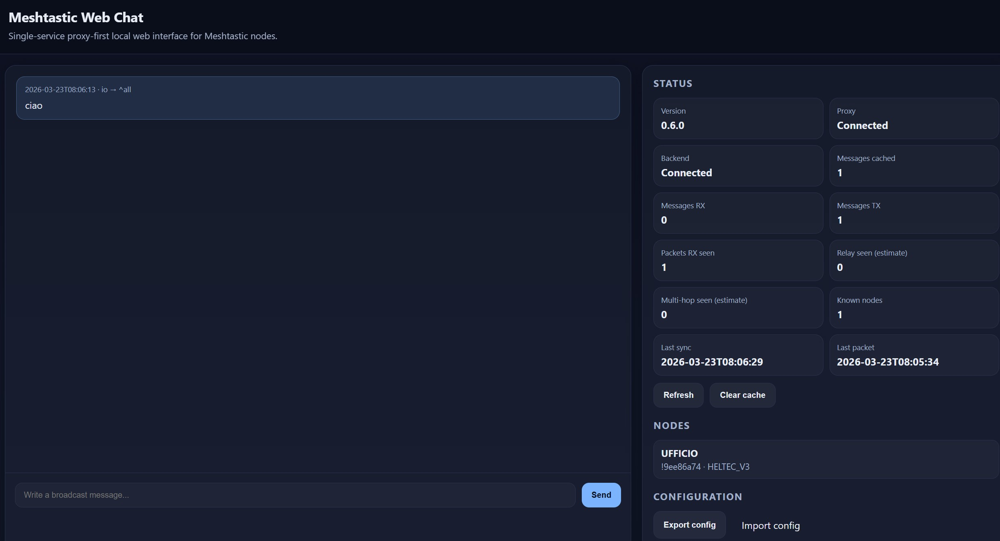

# Meshtastic Web Chat

**Version:** v0.6.0  
**Internal folder path:** `meshtastic_webchat`  
**Systemd service:** `meshtastic-webchat.service`

## Screenshot



## Project purpose

Meshtastic Web Chat is a small local web interface for Meshtastic nodes.

This project exists to provide a more practical browser-based chat and monitoring experience, while avoiding the instability that can appear when multiple clients talk directly to a Meshtastic node over TCP at the same time.

## Why this project uses a local proxy

A single Meshtastic node can become unreliable when several clients compete for the same direct connection, especially over TCP/Wi-Fi.

To make the setup more stable, this project uses a **proxy-first architecture**:

```text
Meshtastic node <-> local proxy <-> web application
```

The local proxy keeps **one** direct connection to the node.
The web application never talks to the node directly.
Instead, it talks only to the local proxy over `127.0.0.1:4404`.

### Benefits

- one single direct client to the node
- cleaner isolation between node access and browser UI
- easier recovery if the upstream node reconnects
- simpler local API for the web frontend
- easier path toward future mobile/client compatibility

## Main features

- browser-based Meshtastic chat
- single-service deployment through `systemd`
- proxy-first embedded architecture
- serial and TCP node support
- local cache of recent messages
- node list and status overview
- debug endpoint
- configuration export and import
- optional HTTPS with Flask `adhoc` SSL
- GitHub-ready screenshot and documentation

## Repository layout

```text
meshtastic_webchat/
├── app.py
├── app_config.json
├── start_webchat.sh
├── meshtastic-webchat.service
├── requirements.txt
├── proxy/
│   ├── __init__.py
│   └── main.py
├── templates/
│   └── index.html
├── docs/
│   └── screenshot-ui-v0.6.0.jpg
└── README.md
```

## Requirements

- Linux system with `systemd`
- Python 3.11+ (tested conceptually with newer Python as well)
- a Meshtastic node available through:
  - serial, for example `/dev/ttyUSB0`
  - or TCP, for example `192.168.0.18`

## Python dependencies

Install dependencies from `requirements.txt`:

```bash
python3 -m venv .venv
source .venv/bin/activate
python -m pip install --upgrade pip
python -m pip install -r requirements.txt
```

## Configuration

All runtime settings live in `app_config.json`.

### Serial example

```json
{
  "version": "0.6.0",
  "node": {
    "mode": "serial",
    "host": "",
    "port": "/dev/ttyUSB0",
    "channel": 0
  },
  "proxy": {
    "host": "127.0.0.1",
    "port": 4404
  },
  "web": {
    "listen_host": "0.0.0.0",
    "listen_port": 8088,
    "ssl_adhoc": true
  }
}
```

### TCP example

```json
{
  "version": "0.6.0",
  "node": {
    "mode": "tcp",
    "host": "192.168.0.18",
    "port": "",
    "channel": 0
  },
  "proxy": {
    "host": "127.0.0.1",
    "port": 4404
  },
  "web": {
    "listen_host": "0.0.0.0",
    "listen_port": 8088,
    "ssl_adhoc": true
  }
}
```

## Running manually

### 1. Start the virtual environment

```bash
source .venv/bin/activate
```

### 2. Start everything through the wrapper

```bash
./start_webchat.sh
```

The wrapper will:

1. start the local proxy
2. wait until the proxy answers on `127.0.0.1:4404`
3. start the Flask web application

## Running with systemd

Install the project under:

```text
/home/meshtastic/meshtastic_webchat
```

Copy the service file:

```bash
sudo cp meshtastic-webchat.service /etc/systemd/system/
```

Reload systemd and start the service:

```bash
sudo systemctl daemon-reload
sudo systemctl enable meshtastic-webchat
sudo systemctl start meshtastic-webchat
```

Check status:

```bash
sudo systemctl status meshtastic-webchat
journalctl -u meshtastic-webchat -f
```

## Accessing the web UI

If `ssl_adhoc` is enabled:

```text
https://YOUR_HOST:8088
```

If `ssl_adhoc` is disabled:

```text
http://YOUR_HOST:8088
```

With Flask adhoc SSL, the browser will show a self-signed certificate warning.
That is expected.

## How the application works

### `start_webchat.sh`

This is the only entry point used by the systemd service.
It reads `app_config.json` indirectly by launching:

- `python -m proxy.main --config app_config.json`
- `python app.py --config app_config.json`

### `proxy/main.py`

The proxy owns the **only direct connection** to the Meshtastic node.
It exposes a simple local JSONL API on `127.0.0.1:4404`.

Supported requests:

- `ping`
- `get_state`
- `get_nodes`
- `get_messages`
- `send_text`
- `debug`

### `app.py`

The Flask application polls only the local proxy.
It does **not** talk to the Meshtastic node directly.

This keeps the browser-facing application simpler and reduces upstream instability exposure.

## Web API routes

### Page

- `GET /`

### Status and cache

- `GET /api/status`
- `GET /api/state`
- `GET /api/nodes`
- `GET /api/messages?limit=100`
- `GET /api/debug`

### Actions

- `POST /api/send`
- `POST /api/clear`

### Config export/import

- `GET /api/config/export`
- `POST /api/config/import`

## Configuration export/import

The web application can export the current `app_config.json` file and import a replacement.

Important:
- importing a config file updates the file on disk
- you should restart `meshtastic-webchat.service` after importing a new configuration

## Notes for serial mode

If you use a serial node, make sure the `meshtastic` user can access the device.
Usually this means adding the user to the `dialout` group:

```bash
sudo usermod -a -G dialout meshtastic
```

Then log out and back in, or reboot.

## Troubleshooting

### The service says the proxy connection is refused

This usually means the local proxy is not running yet, or the wrapper did not finish startup.
Check:

```bash
journalctl -u meshtastic-webchat -f
ss -ltnp | grep 4404
```

### TCP mode times out but the node still answers ping

This means the node is alive at the IP layer, but the Meshtastic client session is not stable enough for direct browser-style use.
That is exactly why this project uses the proxy-first layout.

### Serial mode works, TCP mode is unstable

That usually points to the node-side TCP session, not the web UI.
The local proxy reduces client-side pressure, but it cannot fix all upstream node firmware or transport issues.

### The browser shows an HTTPS certificate warning

That is expected when `ssl_adhoc` is enabled.
Flask generates a temporary self-signed certificate.

## Changelog

### v0.6.0

- rebuilt from a clean, coherent base
- single-service deployment through `meshtastic-webchat.service`
- single internal folder path: `meshtastic_webchat`
- real config file workflow through `app_config.json`
- local wrapper `start_webchat.sh`
- embedded proxy under `proxy/`
- English-only README
- screenshot path aligned for GitHub rendering
- browser UI refreshed and simplified
- proxy JSONL protocol kept intentionally simple and local-only

## Known limitations

- the local proxy protocol is not yet a full Meshtastic client API replacement
- the web UI is designed for local deployment, not as a public internet service
- direct Meshtastic TCP upstream stability still depends on the upstream node and firmware behavior
- HTTPS uses Flask adhoc SSL, which is convenient but not production-grade TLS

## Recommended GitHub publication workflow

1. extract this package over your existing `meshtastic_webchat` folder
2. verify `app_config.json`
3. verify `README.md` screenshot path
4. test locally
5. commit and push

Example:

```bash
git add .
git commit -m "Release v0.6.0: coherent single-service proxy-first rebuild"
git push
```
