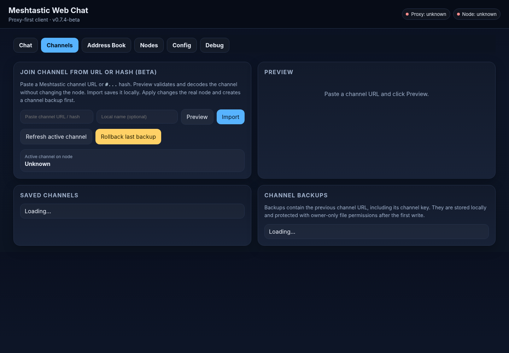

# Meshtastic Web Chat

**Version:** v0.7.4-beta  
**Status:** Level B beta  
**Internal folder:** `meshtastic_webchat`  
**systemd service:** `meshtastic-webchat.service`

## Purpose

Meshtastic Web Chat is a lightweight browser interface for a Meshtastic node. It keeps one long-lived Meshtastic connection in a local proxy and lets the Flask web application use that proxy for chat, node information, aliases and channel management.

## v0.7.4-beta optimization release

This release focuses on reliability and code cleanup rather than adding unrelated features.

### Main changes

- real CSS-based navigation tabs remain available even if application JavaScript fails;
- browser refresh now uses one consolidated `/api/snapshot` call instead of many parallel API requests;
- proxy polling also uses one consolidated local snapshot request;
- active channel reads and channel apply/rollback use the already-open Meshtastic Python interface (`localNode.getURL()` / `localNode.setURL()`) instead of launching a second Meshtastic CLI connection;
- channel URL **Preview** validates and decodes the URL before it is saved or applied;
- channel operations are serialized so Apply and Rollback cannot run at the same time;
- channel backup JSON writes are atomic and owner-only after first write;
- message synchronization keeps the proxy message ID to prevent duplicate messages after service restarts;
- **Clear message cache** clears both the web cache and proxy cache;
- the launcher reads the proxy host/port from `app_config.json` instead of hard-coding `127.0.0.1:4404`;
- the launcher supervises both proxy and web processes; if either one dies, systemd restarts the complete service;
- JSON configuration writes are atomic and imported configuration is validated before replacement;
- cross-origin state-changing browser requests are rejected;
- the UI no longer uses inline JavaScript event handlers for dynamic nodes/rooms;
- periodic refresh pauses while the page is hidden and does not intentionally overlap itself;
- message scrolling is preserved when the user has scrolled up;
- address-book notes are editable in the UI;
- timestamps are timezone-aware; no `datetime.utcnow()` usage remains.

## Interface

The UI is divided into six selectable tabs:

- **Chat** — messages, direct/broadcast recipient, active channel and compact statistics.
- **Channels** — URL/hash preview, local import, explicit Apply, active-channel refresh, automatic backup and rollback.
- **Address Book** — `node_id -> alias` mappings and optional notes.
- **Nodes** — known nodes, last-heard information and quick actions.
- **Config** — import/export of this application's `app_config.json` and message-cache maintenance.
- **Debug** — complete statistics and the current proxy snapshot.

## Channel workflow

1. Open **Channels**.
2. Paste a Meshtastic channel URL or `#...` hash.
3. Click **Preview**. This validates the encoded Meshtastic ChannelSet without modifying the radio.
4. Optionally provide a local name and click **Import**.
5. Click **Apply** on a saved channel.
6. The current channel URL is backed up with secondary channels included before the new channel is written.
7. Use **Rollback last backup** to restore the previous channel.

The backup contains the channel URL, which contains channel key material. Treat `rooms.json` and `room_backups.json` as sensitive files.

## Important distinction: app config vs radio config

The **Config** tab imports/exports only `app_config.json` for this web application. It is not presented as a complete Meshtastic radio backup/restore mechanism.

The **Channels** tab backs up and restores the Meshtastic channel URL used by the radio; when supported by the installed Meshtastic Python library, the backup includes secondary channels as well as the primary channel. Full-device configuration restore is intentionally outside this beta workflow.

## Screenshot



## Installation / upgrade

The target directory remains:

```text
/home/meshtastic/meshtastic_webchat
```

Create the virtual environment if it does not already exist:

```bash
cd /home/meshtastic/meshtastic_webchat
python3 -m venv .venv
source .venv/bin/activate
python -m pip install --upgrade pip
python -m pip install -r requirements.txt
```

The release archive intentionally does **not** contain `app_config.json`, `address_book.json` or `rooms.json`, so extracting a new release over an existing installation does not overwrite local configuration, aliases or saved channels. On a fresh installation, `start_webchat.sh` creates `app_config.json` from `app_config.example.json` if needed.

Install the service:

```bash
sudo cp meshtastic-webchat.service /etc/systemd/system/meshtastic-webchat.service
sudo systemctl daemon-reload
sudo systemctl enable meshtastic-webchat
sudo systemctl restart meshtastic-webchat
```

Follow logs with:

```bash
journalctl -u meshtastic-webchat -f
```

## Configuration

`app_config.json` is the runtime source of truth. The package provides `app_config.example.json` as the fresh-install template. Example serial configuration:

```json
{
  "version": "0.7.4-beta",
  "node": {
    "mode": "serial",
    "host": "",
    "port": "/dev/ttyUSB0",
    "channel": 0
  },
  "proxy": {
    "host": "127.0.0.1",
    "port": 4404
  },
  "web": {
    "listen_host": "0.0.0.0",
    "listen_port": 8088,
    "ssl_adhoc": true
  },
  "ui": {
    "default_language": "en"
  }
}
```

For TCP mode set `node.mode` to `tcp` and put the radio IP/hostname in `node.host`.

## Files

- `app.py` — Flask web application and local cache.
- `proxy/main.py` — single long-lived Meshtastic connection and local JSON socket API.
- `templates/index.html` — complete browser UI.
- `app_config.example.json` — packaged default configuration template.
- `app_config.json` — runtime configuration, created only if missing and intentionally not shipped in the ZIP so upgrades do not overwrite local settings.
- `address_book.json` — local aliases.
- `rooms.json` — imported channel URLs.
- `room_backups.json` — channel rollback history (created on first backup).
- `proxy_messages.db` — proxy message history.
- `webchat_cache.db` — web-side synchronized message cache.
- `start_webchat.sh` — launcher/supervisor for proxy + Flask app.
- `meshtastic-webchat.service` — single systemd unit.
- `tools/static_selftest.py` — dependency-light release consistency checks.

## Static self-test

Before deploying a release you can run:

```bash
cd /home/meshtastic/meshtastic_webchat
python3 tools/static_selftest.py
bash -n start_webchat.sh
```

## Upgrade notes from v0.7.3-beta

The existing `app_config.json`, `webchat_cache.db`, `proxy_messages.db`, `address_book.json` and `rooms.json` are retained. The release ZIP does not contain mutable runtime JSON files, so a normal overwrite extraction cannot reset aliases, rooms or node connection settings. On startup, the web cache schema is migrated automatically to add the proxy message ID used for restart-safe deduplication.

A hard browser refresh after upgrade is still recommended, although v0.7.4-beta now sends `Cache-Control: no-store` for the UI and API.

## Security notes

This project is intended for a trusted local network. It does not currently provide user authentication. If the web listener is exposed beyond a trusted LAN, put it behind an authenticated reverse proxy and proper TLS.

Room/channel URLs contain channel key material. Keep the project directory and backups private.

## Changelog

### v0.7.4-beta

- reliability and concurrency cleanup;
- direct Meshtastic Python API for channel read/apply/rollback;
- one-shot snapshot refresh path;
- channel URL preview;
- restart-safe message deduplication;
- launcher now supervises both child processes;
- startup proxy health check is driven by `app_config.json`;
- atomic JSON writes and stricter input/config validation;
- release archive no longer overwrites mutable runtime JSON files during upgrades;
- improved UI event handling, status visibility and refresh behavior.

### v0.7.3-beta

- CSS/radio based visible tabs;
- dedicated Channels view;
- Level B channel import/apply/rollback workflow.
