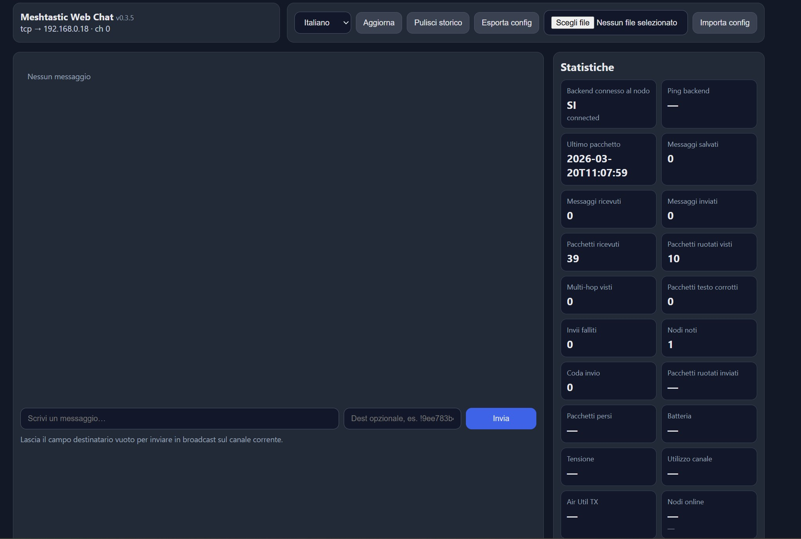

# Meshtastic Web Chat

**Version:** v0.6.4  
**Package path:** `meshtastic_webchat`  
**Service name:** `meshtastic-webchat.service`

Meshtastic Web Chat is a local browser-based interface for Meshtastic nodes built around a **proxy-first** architecture.

The web UI does **not** connect directly to the radio node. Instead, it talks to a local embedded proxy process that owns the single upstream connection to the node. This design improves stability when direct TCP access is fragile or when multiple clients would otherwise interfere with each other.

## Project goals

- provide a simple local web chat for Meshtastic nodes
- keep deployment simple with a single systemd service
- avoid direct multi-client access to the node
- provide a friendlier browser UI with useful status information
- maintain a local address book that maps `node_id -> alias`
- support direct messaging without forcing users to remember raw node IDs

## Key features

- single-service startup via `meshtastic-webchat.service`
- embedded local proxy started automatically by `start_webchat.sh`
- support for **serial** and **TCP** nodes through `app_config.json`
- HTTPS via Flask ad-hoc certificates
- cached messages stored locally in SQLite
- node list, status, debug endpoint, config export/import
- local address book (`node_id -> alias`)
- aliases shown in node list, message list, and recipient selector
- recipient selector merges **live nodes + address book entries**
- direct message support from the chat composer
- GitHub-friendly screenshot and documentation

## Architecture

```text
Meshtastic node <-> embedded local proxy <-> web application <-> browser
```

The browser only talks to the web application.
The web application only talks to the local proxy.
The local proxy owns the one real connection to the node.

## Address book

The address book is a local correlation between a Meshtastic `node_id` and a human-friendly alias.

Examples:

```text
!9ee86a74 -> OFFICE
!9ee783b4 -> HOME
```

This mapping is local to the web application. It does **not** modify the actual Meshtastic node name.

### Why it exists

Meshtastic node IDs are stable but not easy to remember. The address book lets you:

- identify nodes quickly in the UI
- read messages more easily
- send direct messages using aliases in the recipient list
- keep your own naming convention without changing node firmware configuration

## Sending messages

The message composer supports both **broadcast** and **direct messages**.

- Select **Broadcast (^all)** to send to the current mesh channel.
- Select a specific node from the recipient dropdown to send a direct message.
- The recipient dropdown merges:
  - nodes currently visible in proxy cache
  - entries saved in the local address book
- Saved aliases are shown before the raw node ID when available.

The application still uses the real Meshtastic `node_id` under the hood. Aliases are only a local UI convenience layer.

## Installation

### 1. Extract the package

Copy the project to:

```text
/home/meshtastic/meshtastic_webchat
```

### 2. Create a virtual environment

```bash
cd /home/meshtastic/meshtastic_webchat
python3 -m venv .venv
source .venv/bin/activate
python -m pip install --upgrade pip
python -m pip install -r requirements.txt
chmod +x start_webchat.sh
```

### 3. Configure the application

Edit:

```text
/home/meshtastic/meshtastic_webchat/app_config.json
```

#### Serial example

```json
{
  "version": "0.6.4",
  "node": {
    "mode": "serial",
    "host": "",
    "port": "/dev/ttyUSB0",
    "channel": 0
  },
  "proxy": {
    "host": "127.0.0.1",
    "port": 4404
  },
  "web": {
    "listen_host": "0.0.0.0",
    "listen_port": 8088,
    "ssl_adhoc": true
  },
  "ui": {
    "default_language": "en"
  }
}
```

#### TCP example

```json
{
  "version": "0.6.4",
  "node": {
    "mode": "tcp",
    "host": "192.168.0.18",
    "port": "",
    "channel": 0
  },
  "proxy": {
    "host": "127.0.0.1",
    "port": 4404
  },
  "web": {
    "listen_host": "0.0.0.0",
    "listen_port": 8088,
    "ssl_adhoc": true
  },
  "ui": {
    "default_language": "en"
  }
}
```

### 4. Install the systemd service

```bash
sudo cp meshtastic-webchat.service /etc/systemd/system/meshtastic-webchat.service
sudo systemctl daemon-reload
sudo systemctl enable meshtastic-webchat
sudo systemctl start meshtastic-webchat
```

### 5. Check logs

```bash
sudo systemctl status meshtastic-webchat
journalctl -u meshtastic-webchat -f
```

## Usage

Open the UI in your browser:

```text
https://YOUR_HOST:8088
```

Because ad-hoc HTTPS is enabled by default, your browser will show a certificate warning the first time.

### Main UI areas

- **Messages**: cached message history from the proxy
- **Status**: backend/proxy state and quick counters
- **Nodes**: known nodes from proxy cache
- **Address Book**: local `node_id -> alias` mapping
- **Configuration**: export/import `app_config.json`
- **Debug**: raw status/state information through `/api/debug`

### Address book workflow

1. open the **Address Book** section
2. enter a `node_id`, for example `!9ee86a74`
3. enter an alias, for example `OFFICE`
4. click **Save alias**

After saving:
- the node list will prefer the alias
- messages from or to that node will show the alias first
- the recipient selector will include that alias even if the node is not currently visible in the live cache

You can also click the **Alias** button next to a node in the node list to prefill the form.

### Direct message workflow

1. open the **Send to** dropdown in the chat composer
2. select either:
   - `Broadcast (^all)`
   - a live node
   - an address book alias
3. type your message
4. click **Send**

You can also click the **Message** button next to an address book entry to preselect that recipient.

## Files

- `app.py` — Flask web application
- `proxy/main.py` — embedded local proxy
- `start_webchat.sh` — launcher used by systemd
- `app_config.json` — runtime configuration
- `address_book.json` — local alias mapping
- `webchat_cache.db` — local cached messages
- `meshtastic-webchat.service` — systemd service unit
- `docs/screenshot-ui-v0.6.4.jpg` — screenshot used in the README

## Screenshot



## Troubleshooting

### Proxy poll failed: connection refused
The proxy is not running or the local proxy port does not match `app_config.json`.

### The web UI loads but shows disconnected state
The proxy is running, but the proxy cannot reach the configured node.

### Serial mode does not work
Check that the configured user can access the serial device, usually by being in the `dialout` group.

### TCP mode times out even though the node IP replies to ping
This usually indicates a Meshtastic TCP/API-level problem rather than a basic network problem. The proxy-first design reduces the impact of that instability, but the upstream node connection can still fail independently of ICMP reachability.

## Changelog

### v0.6.4
- Fixed the direct-message recipient selector so it merges **live nodes + address book entries**.
- Aliases saved in the address book now appear in the recipient selector even when the node is not currently present in the live proxy cache.
- Added a **Message** button to address book entries to preselect the direct-message recipient.
- Updated the README to match the actual recipient-selector behavior and removed older duplicated changelog sections.

### v0.6.3
- Removed the right-side raw debug text panel to keep the interface cleaner.
- Made direct messaging clearer by adding a dedicated "Send to" label above the recipient selector.
- Clarified in the address book section that aliases appear in the direct-message recipient list.
